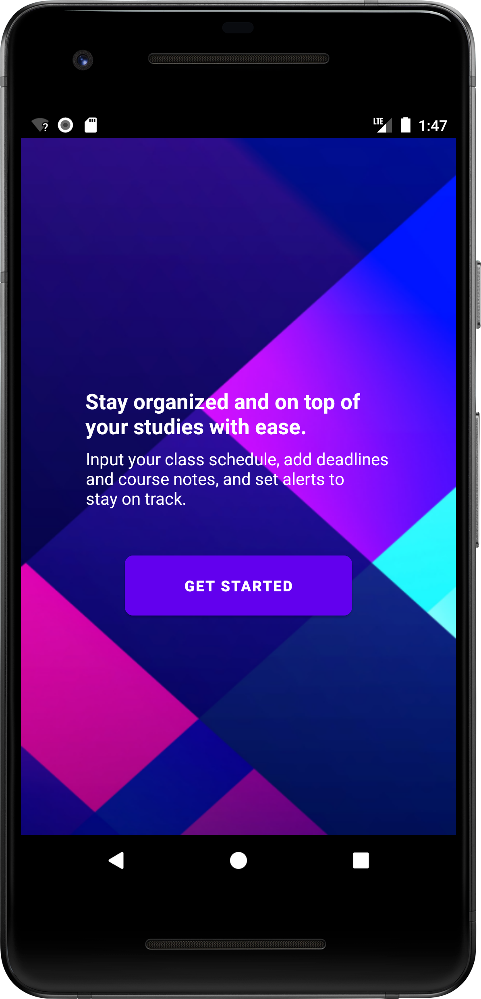
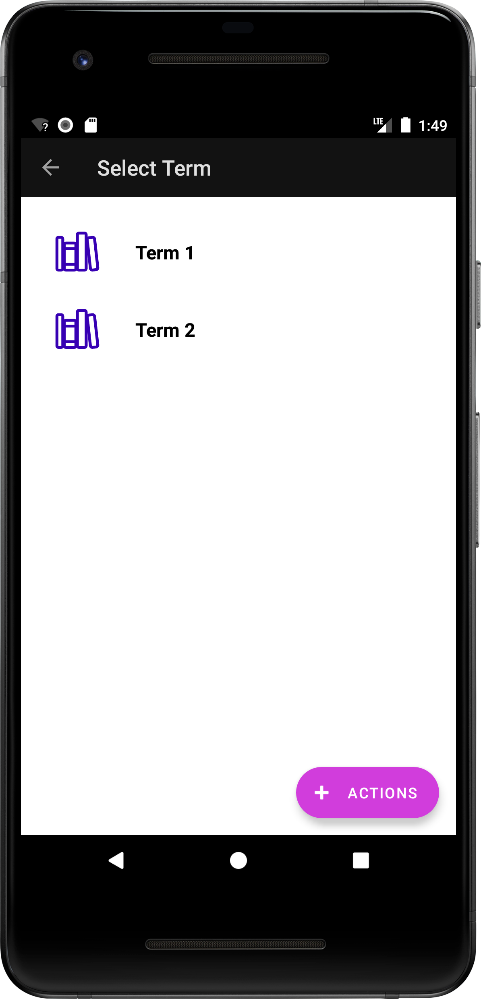

# Student Scheduler

 
 

This mobile application provides a convenient way for students to manage their academic schedule, including terms, courses, assessments, and alerts to stay organized throughout their academic journey.

## Features

- Term Management: Add, modify, and delete academic terms.
- Course Management: Add, modify, and delete courses within each term.
- Assessment Tracking: Keep track of assessments associated with each course.
- Alerts and Reminders: Set up alerts for important course dates and assessments.
- Course Notes: Add and manage notes for individual courses.
- Communication: Share course notes via email or messaging.

## Technologies Used

- Java
- Android Studio

## Image Credits

The following images are used in this project and are sourced from:

- Colorful Background - Splash Screen(https://ionic.io/ionicons/) - Photo by Codioful (Formerly Gradienta) 
